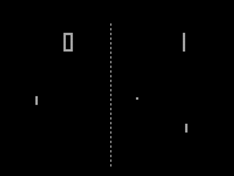
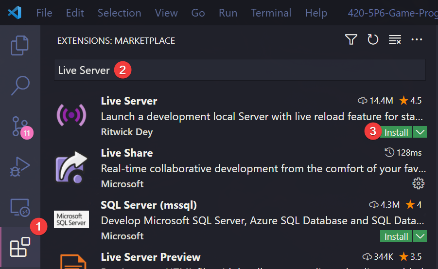
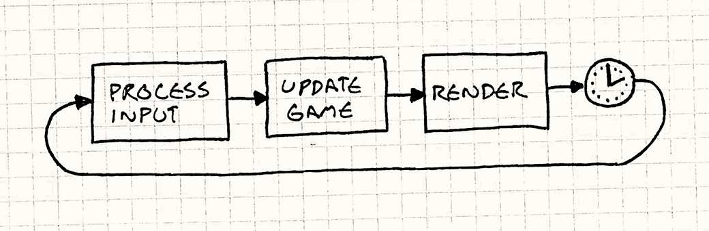
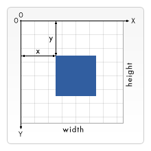

# 🏓 Pong

You can view the pretty version of the notes [here](https://jac-cs-game-programming-fall22.github.io/Notes/#/0-Pong/).

## 🎯 Objectives

- **HTML5 Canvas w/ JS**: This is the programming language that we'll be using throughout the course. We'll also learn about the [HTML `<canvas>` element](https://developer.mozilla.org/en-US/docs/Web/HTML/Element/canvas).
- **Drawing Shapes and Text**: Two of the most basic principles of game development, being able to draw shapes and text is what will allow us to render our game on a screen.
- **DeltaTime and Velocity**: DeltaTime, arguably one of the most important variables that we keep track of in any game framework, is the time elapsed since the last frame of execution in our game. We'll see how this concept relates to velocity.
- **Game State**: Every game is composed of a series of states (e.g., the title screen state, gameplay state, menu state, etc.), so it will be important to understand this concept since we'll want different rendering logic and update logic for each state.
- **Basic OOP (Object-Oriented Programming)**: The use of Object-Oriented Programming will allow us to encapsulate our data and game objects such that each object in our game will be able to keep track of all the information that is relevant to it, as well as have access to specific functions that are unique to it.
- **Box Collision (Hitboxes)**: Understanding the concept of box collision will be necessary in order to bring Pong to life, since we'll need to be able to "bounce" a ball back and forth between two paddles. The ball and paddles will be rectangular, so we'll focus on "Axis-Aligned Bounding Boxes," which will allow us to calculate collisions.
- **Sound Effects (with bfxr)**: Lastly, we'll learn how to polish up our game with sound effects in order to make it more exciting and immersive.

We are aiming to recreate "Pong"; a simple 2 player game in which one player has a paddle on the left side of the screen, the other player has a paddle on the right side of the screen, and the first player to score 10 times on their opponent wins. A player scores by getting the ball past the opponent's paddle and into their "goal" (i.e., the edge of the screen).

- First off, we'll want to draw shapes to the screen (e.g., paddles and ball) so that the user can see the game.
- Next, we'll want to control the 2D position of the paddles based on input, and implement collision detection between the paddles and ball so that each player can deflect the ball back toward their opponent.
- We'll also need to implement collision detection between the ball and screen boundaries to keep the ball within the vertical bounds of the screen and to detect scoring events (outside horizontal bounds).
- At that point, we'll want to add sound effects for when the ball hits paddles and walls, and for when a point is scored.
- Lastly, we'll display the score on the screen so that the players don't have to remember it during the game.



_Image from [Wikipedia](https://upload.wikimedia.org/wikipedia/commons/thumb/f/f8/Pong.png/480px-Pong.png)_

## 🔨 Setup

1. Clone the repo (or download the zip) for today's lecture, which you can find [here](https://github.com/JAC-CS-Game-Programming-F21/0-Pong).
2. Open the repo in Visual Studio Code.
3. Start Visual Studio Code's "Live Server" extension. If you don't have it installed:
   1. Click on the extensions icons in the left-hand side navigation.
   2. Search for "Live Server".
   3. Click install next to the extension by "Ritwick Dey". You may have to reload the window.

      

   4. Once it's installed, click "Go Live" on the bottom right of the window. This should start the server and automatically open a new tab in your browser at `http://127.0.0.1:5500/` (or whatever port it says on your machine).
      - The files the server serves will be relative to the directory you had open in VSC when you hit "Go Live".

## ➰ What is a game loop?

A game, fundamentally, is an infinite loop, like a `while(true)`. During every iteration of that loop, we're repeatedly performing the following set of steps:

1. First, we're processing input. That is to say, we're constantly checking: has the user pressed a key on the keyboard, moved the joystick, moved/clicked the mouse, etc.?
2. Second, we need to respond to that input from the previous step by updating anything in the game that depends on that input (i.e., tracking movement, detecting collisions, etc.).
3. Third, we need to re-render anything that was updated in the previous step, so that the user can see visually on the screen that the game has changed and feel a sense of interactivity.



_Image from [Game Programming Patterns](gameprogrammingpatterns.com/game-loop.html), where you can read more about game loops._

## 📉 2D Coordinate System

In the context of 2D games, the most fundamental way of looking at the world is by using the 2D coordinate system.

Slightly different from the traditional coordinate system you might've used in Math class, the 2D coordinate system we're referring to here is a system in which objects have an X and Y coordinate (X, Y) and are drawn accordingly, with (0, 0) being the top-left of the system. This means positive directions moving down and to the right, while negative directions move up and to the left.



_Image from [MDN](https://developer.mozilla.org/en-US/docs/Web/API/Canvas_API/Tutorial/Drawing_shapes)._

## ⌚ Delta Time

> The content for this section was taken from [this amazing article](https://drewcampbell92.medium.com/understanding-delta-time-b53bf4781a03) by Drew Coleman. If you want a more in-depth explanation about delta time, I highly recommend reading the article in its entirety!

Combining the previous two sections, we paint (and repaint) on a 2D canvas over and over again until the game stops. This repainting is what gives the illusion of things being moved on the screen. But, how fast is the repainting happening? This depends on the hardware your game is running on. You may have heard the terms "30 FPS" and "60 FPS" before. FPS stands for "frames per second". A "frame" is a single painting of our animation.

For example, if our hardware runs at 3 frames per second, this means that in one second, we have 3 repaints.


In other words, we have 1 repaint (roughly) every 0.33 seconds. Our **delta time** in this case is 0.33 seconds.

One of the problems that **delta time** solves is making a game feel the same on different hardware.

### Why Frame Rate Dependency is Bad

A game that is frame rate dependent is one in which parts of the game is tied specifically to the number of frames the device the game is running on can draw.

Let's look at one area in a game which shouldn't be frame rate dependent, **movement**. When we are describing movement it's in terms of the distance we travel over some specified time, like pixels per second (p/s), or kilometers per hour (kmph). If our game is frame rate dependent, then the speed at which our objects move is tied to the frame rate which means the speed of our game objects will be different on different hardware.


Assuming we have a spaceship and we want it to move at 10p/s, if we knew our game ran at 30fps on our device, then we would want it to move at 0.33333 pixels per frame.


However, as soon as we run our game on a different device then the speed at which our ship moves will no longer be at 10p/s. On a device that can run our game at 60fps, we would have moved 20p/s. This is because we would be moving at 0.33333 pixels per frame, but the number of paints we're doing in 1 second has **doubled**!

### Delta Time to the Rescue

> **TL;DR**: Any time you change the position of something on the screen, scale it by delta time.

Delta time is the solution to solving our problem, freeing our code from the frame rate, making it frame rate independent.

How using delta time does this is quite simple. If we first look at the problem of running our game on different hardware devices that run the game at different frames per second. If we still want our spaceship to fly at 10p/s but we want it to run on devices that can handle both 30 and 60fps. Then all we need to do each frame is multiply our game speed by the delta time (measured in seconds) value. Below is some code showing how the spaceship can be moved in the positive x-axis by 10p/s using delta time.

```javascript
// Old
function update() {
    spaceship.x += 10; // Every frame, move the spaceship 10 pixels to the right.
}

// New
function update(dt) {
    spaceship.x += 10 * dt; // Every frame, move the spaceship (10 * dt) pixels to the right.
}
```

Now, at 30fps the delta time value will be 0.033333 seconds so each frame we update our ship by 10 pixels per second multiplied by delta time:

```text
10 * 0.033333 = 0.33333 pixels per frame

0.33333 * 30 ~= 10 pixels per second
```

Notice, we get the same value as before. What is different, is that if our game is running at 60fps then the delta time will be at 0.016666:

```text
10 * 0.016666 = 0.16666 pixels per frame

0.16666 * 60 ~= 10 pixels per second
```

No matter how fast or slow the hardware is, our game will always behave the same - Hurray! 🎉

## 🌅 Pong-0 (The "Day-0" Update)

At this point, you will want to have downloaded the demo code in order to follow along. Be sure to pay attention to the comments in the code!

Pong-0 simply prints "Hello Pong!" exactly in the center of the screen. This is not incredibly exciting, but it does showcase how to use HTML5 canvas' most important functions moving forward.

### Important Functions

- `canvas.getContext('2d')`
  - This function returns a `context` object. The `context` object contains all of the methods we need to draw things to the screen.
- `gameLoop(currentTime)`
  - This function is the heartbeat of the application. It is called 60 times per second (depending on your monitor's refresh rate) and it is what we will use to drive our game's animations. The way that this function is called 60 times per second is by using JavaScript's `requestAnimationFrame()` API which you can read more about [here](https://developer.mozilla.org/en-US/docs/Web/API/window/requestAnimationFrame).
- `update(dt)`
  - This function is called by `gameLoop()` at each frame of program execution; `dt` (i.e., DeltaTime) will be the elapsed time in seconds since the last frame, and we can use this to scale any changes in our game for even behavior across frame rates.
  - This is where the logic of our game will be executed.
- `render()`
  - This function is also executed at each frame since it is called by `update()`. It is called after the update step completes so that we can draw things to the screen once they've changed.
- `context.clearRect(x, y, width, height)`
  - This function erases the canvas at the specified dimensions. We need to perform this on every single frame render so that we can draw the updated shapes.
- `context.fillText(text, x, y)`
  - A print function that will print the specified `text` to the specified coordinates.

Now, with these puzzle pieces in mind, you can see how we're rendering "Hello Pong!" to the center of the screen:

### Important Code

We initialize our game by creating the `canvas` element and getting the `context` object from it. Next, we set the width and height of the canvas. Then, we have to append the canvas element to the DOM. Finally, we declare `lastTime` which will be used to calculate delta time later on.

```javascript
const canvas = document.createElement('canvas');
const context = canvas.getContext('2d') || new CanvasRenderingContext2D();
const CANVAS_WIDTH = 1280;
const CANVAS_HEIGHT = 720;

canvas.width = CANVAS_WIDTH;
canvas.height = CANVAS_HEIGHT;

document.body.appendChild(canvas);

let lastTime = 0;
```

Then we define `gameLoop()`, calculate `deltaTime`, and call `update()`. The mechanism that calls `gameLoop()` over and over again is `requestAnimationFrame()`.

```javascript
function gameLoop(currentTime = 0) {
    const deltaTime = (currentTime - lastTime) / 1000;

    update(deltaTime);
    lastTime = currentTime;
    requestAnimationFrame(gameLoop);
}
```

Next, we define `render()` so that we can specify the text we'd like to render to the screen, in this case "Hello Pong!", along with coordinates for where it should be drawn.

```javascript
function render() {
    context.clearRect(0, 0, CANVAS_WIDTH, CANVAS_HEIGHT);

    context.font = "60px Comic Sans MS";
    context.fillStyle = "white";
    context.textBaseline = 'middle';
    context.textAlign = 'center';
    context.fillText(
        `Hello Pong!`,     // text to render
        CANVAS_WIDTH / 2,  // X coordinate
        CANVAS_HEIGHT / 2, // Y coordinate
    );
}
```

## 🟪 Pong-1 (The "Rectangle" Update)

Pong-1 produces a more complete (static) image of what our Pong program should look like.

### Important Functions

- `new FontFace(name, path)`
  - This instantiates a new `FontFace` object from a font file that lives on disk.
- `myFont.load()`
  - This function will load the font into memory from disk so that it is ready to be used in our game.
- `context.fillRect(x, y, width, height)`
  - Draws a rectangle onto the screen. The four parameters are its position and size dimensions. This is the cornerstone drawing function of the entirety of our Pong implementation!

### Important Code

Alongside `main.js` file and `index.html`, you'll find that we've added a font file to our project called `Joystix.ttf`. This is the "retro" font we'll use to make our Pong game look more authentic.

On that note, you'll find a small addition at the top of our main:

```javascript
const myFont = new FontFace('Joystix', 'url(./Joystix.ttf)');

myFont.load().then(function (font) {
    document.fonts.add(font);
});
```

This will allow us to create a custom font object (based off the font file we've added to our project directory) that we can set as the active font in our game.

The only other changes to the code in this update can be found in the `render()` function.

```javascript
context.fillText(`${player1Score}`, CANVAS_WIDTH * 0.25, 50);
context.fillText(`${player2Score}`, CANVAS_WIDTH * 0.75, 50);

context.fillRect(CANVAS_WIDTH / 2 - 10, CANVAS_HEIGHT / 2 - 10, 20, 20);
context.fillRect(30, 30, 20, 200);
context.fillRect(CANVAS_WIDTH - 50, CANVAS_HEIGHT - 230, 20, 200);
```

As you can see, we are writing the score at the top of the screen, and drawing rectangles for the paddles and the ball. The paddles are positioned on opposing ends of the screen, and the ball in the center.

## 🏓 Pong-2 (The "Paddle" Update)

Pong-2 adds interactivity to the paddles by letting us move them up and down using the `w` and `s` keys for the left paddle, and the `up` and `down` keys for the right paddle.

### Important Functions

- `canvas.addEventListener(eventName, function)`
  - This registers an event listener that triggers a callback function that executes whenever we press a key. We will use this to set different keys in our `keys` object to `true` and `false` which will allow us to receive input from the keyboard for our game.

### Important Code

You'll notice we've added a new constant near the top of `main.js`:

```javascript
const PADDLE_SPEED = 1000;
```

This is an arbitrary value that we've chosen for our paddle speed. It will be scaled by DeltaTime, so it'll be multiplied by how much time has passed (in terms of seconds) since the last frame, so that our paddle movement will remain consistent regardless of how quickly or slowly our computer is running.

You'll also find some new variables:

```javascript
let player1Score = 0;
let player2Score = 0;
let player1Y = 30;
let player2Y = CANVAS_HEIGHT - 230;
```

In particular, we've created two variables for the purpose of scorekeeping and two variables to keep track of each paddle's vertical position. Since the paddles will be able to move up and down, we only need to keep track of the Y position and not the X.

Next, you'll see that we've finally defined behavior for `update()`:

```javascript
if (keys.w) {
    player1Y -= PADDLE_SPEED * dt;
}
else if (keys.s) {
    player1Y += PADDLE_SPEED * dt;
}

if (keys.ArrowUp) {
    player2Y -= PADDLE_SPEED * dt;
}
else if (keys.ArrowDown) {
    player2Y += PADDLE_SPEED * dt;
}
```

Here, we've implemented a way for each player to move their paddle. Recall that our 2D coordinate system is centered at the top left of the screen. Therefore, in order for each paddle to move upwards, its Y position will need to be multiplied by negative velocity (and vice versa), which might seem counterintuitive at first glance, so be sure to take a moment to look at this carefully.

## ⚾ Pong-3 (The "Ball" Update)

Pong-3 adds motion to the ball upon the user pressing enter.

### Important Functions

- `Math.random()`
  - Returns a random number between 0 and 1.
- `Math.min(number1, number2)`
  - Returns the lesser of the two numbers passed in.
- `Math.max(number1, number2)`
  - Returns the greater of the two numbers passed in.
- `Math.floor(floatingPointNumber)`
  - Returns the largest integer less than or equal to a given floating point number.

### Important Code

You'll see a few new variables near the bottom of load():

```javascript
let ballX = CANVAS_WIDTH / 2 - 10;
let ballY = CANVAS_HEIGHT / 2 - 10;
let ballDX = generateRandomNumber(400, 600);
let ballDY = generateRandomNumber(400, 600);

let gameState = 'start';
```

`ballX` and `ballY` will keep track of the ball position, while `ballDX` and `ballDY` will keep track of the ball velocity. `gameState` will serve as a rudimentary "state machine", such that we'll cycle it through the different states of our game (start, play, etc.).

In `update()`, we tweak our code for paddle movement by wrapping it around the `Math.max()` and `Math.min()` functions to ensure that the paddles can't move beyond the edges of the screen:

```javascript
if (keys.w) {
    player1Y = Math.max(0, player1Y - PADDLE_SPEED * dt);
}
else if (keys.s) {
    player1Y = Math.min(CANVAS_HEIGHT - 200, player1Y + PADDLE_SPEED * dt);
}

if (keys.ArrowUp) {
    player2Y = Math.max(0, player2Y - PADDLE_SPEED * dt);
}
else if (keys.ArrowDown) {
    player2Y = Math.min(CANVAS_HEIGHT - 200, player2Y + PADDLE_SPEED * dt);
}
```

We also add new code to ensure the ball can only move when we are in the "play" state:

```javascript
if (gameState === 'play') {
    ballX += ballDX * dt;
    ballY += ballDY * dt;
}
```

Following this, we add functionality to launch the game (thus transitioning from the "start" state to the "play" state) and implement ball movement mechanics:

```javascript
if (keys.Enter) {
    keys.Enter = false;

    if (gameState === 'start') {
        gameState = 'play';
    }
    else {
        gameState = 'start';

        ballX = CANVAS_WIDTH / 2 - 10;
        ballY = CANVAS_HEIGHT / 2 - 10;
        ballDX = generateRandomNumber(400, 600);
        ballDY = generateRandomNumber(400, 600);
    }
}
```

Once in the "play state", we start the ball's position in the center of the screen and assign it a random starting velocity.

Lastly, we tweak our `render()` function so that we can see the changes from `update()` at each frame:

```javascript
context.fillRect(ballX, ballY, 20, 20);
```

The only change of note is using the ball's position variables to draw the ball to the screen instead of the static values we had before. This will make it appear like the ball is travelling across the screen.

## 📦 Pong-4 (The "Class" Update)

Pong-4 behaves exactly like Pong-3. The biggest advantage we gain from this update is in the design of our code. Open up Pong-4 to take a look at how we've reorganized the code using classes and objects.

### JS Modules

It is important to understand that all of the JS we are writing here is **client-side**. This means that the code is executed within your web browser. This is different than last semester in Web II where we wrote our code **server-side** which meant that the code was executed within the NodeJS runtime.

Since we're writing **client-side** JS, we cannot use the `require` statement to include modules from other files that were exported using the `module.exports` object as these are Node specific keywords. To do the equivalent in the browser, we use the `import` and `export` statements. Here's an example:

```javascript
// Ball.js
export default class Ball { ... }

// main.js
import Ball from "./Ball.js";
```

Also, we have to make sure that the entrypoint to our application (`main.js`) is declared as a module in `index.html`:

```html
<script type="module" src="main.js"></script>
```

Now, we can instantiate an object of type `Ball` in `main.js`!

### Important Code

The main takeaway from this update is that we now have abstracted away from `main.js` the logic relevant to paddle and ball mechanics. These are now in their own classes, so you'll see a few new files in the project directory. `Ball.js` contains all the logic specific to the ball, while `Paddle.js` contains all the logic specific to each paddle.

This not only gives us greater flexibility moving forward, it also makes our `main.js` file cleaner and more readable.

## 🎯 Pong-5 (The "Collision" Update)

Pong-5 allows for the ball to bounce off the paddles and window boundaries. Open up Pong-5 to take a look at how we've incorporated AABB Collision Detection into our Pong program.

### AABB Collision Detection

- AABB Collision Detection relies on all colliding entities to have "axis-aligned bounding boxes", which simply means their collision boxes contain no rotation in our world space, which allows us to use a simple formula to test for collision:

```javascript
if (rect1.x < rect2.x + rect2.width
 && rect2.x < rect1.x + rect1.width
 && rect1.y < rect2.y + rect2.height
 && rect2.y < rect1.y + rect1.height) {
    // collision is true
}
else {
    // collision is false
}
```

- Essentially, the formula is checking if the two boxes are colliding in any way.
- We can use AABB Collision Detection to detect whether our ball is colliding with our paddles and react accordingly.
- We can apply similar logic to detect if the ball collides with a window boundary.

```iframe
height="537"
width="100%"
scrolling="no"
title="AABB Collision Detection Visualization"
src="https://codepen.io/vsingh7/embed/powJMYW?default-tab=result"
frameborder="no"
loading="lazy"
allowtransparency="true"
allowfullscreen="true"
textContent="See the Pen <a href='https://codepen.io/vsingh7/pen/powJMYW'>AABB Collision Detection Visualization</a> by Vikram Singh (<a href='https://codepen.io/vsingh7'>@vsingh7</a>) on <a href='https://codepen.io'>CodePen</a>."
```

### Important Code

Notice how we've added a `didCollide()` function to our `Ball` class. It uses the above algorithm to determine whether there has been a collision, returning `true` if so and `false` otherwise.

We can use this function in `Ball::update()` to keep track of the ball's changing position and velocity after each collision with a paddle:

```javascript
if (this.didCollide(player1) || this.didCollide(player2)) {
    this.dx = -this.dx * 1.03;

    if (this.dy < 0) {
        this.dy = generateRandomNegativeNumber(400, 800);
    }
    else {
        this.dy = generateRandomPositiveNumber(400, 800);
    }
}
```

We also implement similar logic for collisions with the window edges:

```javascript
if (this.y <= 0) {
    this.y = 0;
    this.dy = -this.dy;
}

if (this.y >= this.canvasHeight - this.height) {
    this.y = this.canvasHeight - this.height;
    this.dy = -this.dy;
}
```

## 🚨 Pong-6 (The "Score" Update)

Pong-6 allows us to keep track of the score.

### Important Code

All we need to do is increment the score variables for each player whenever the ball goes past their goal boundary:

```javascript
if (ball.x + ball.width < 0) {
    player2Score++;
    ball.reset(CANVAS_WIDTH / 2 - 10, CANVAS_HEIGHT / 2 - 10);
    gameState = 'start';
}
else if (ball.x > CANVAS_WIDTH) {
    player1Score++;
    ball.reset(CANVAS_WIDTH / 2 - 10, CANVAS_HEIGHT / 2 - 10);
    gameState = 'start';
}
```

## ↪️ Pong-7 (The "Serve" Update)

Pong-7 introduces a new state, "serve", to our game.

### What is a State Machine?

- Currently in our Pong program we've only talked about state a little bit. We have our "start" state, which means the game is ready for us to press "enter" so that the ball will start moving, and our "play" state, which means the game is currently underway.
- A state machine concerns itself with monitoring what is the current state and what transitions take place between possible states, such that each individual state is produced by a specific transition and has its own logic.
- In Pong-7, we allow a player to "serve" the ball by not having to defend during their first turn.
- We transition from the "play" state to the "serve" state by scoring, and from the "serve" state to the "play" state by pressing enter. The game begins in the "start" state, and transitions to the serve state by pressing enter.

### Important Code

We can add our new "serve" state by making an additional condition within our `update()` function:

```javascript
if (gameState === 'start') {
    gameState = 'serve';
}
else if (gameState === 'serve') {
    gameState = 'play';
}
```

The idea is that when a player gets scored on, they should get to serve the ball, so as to not be immediately on defense. We do this by passing the currently serving player to the ball's `reset()` method so that it can set the balls new velocity according to who is serving.

We introduce a new state: "victory", and then we set a maximum score (in our case, 10). Within `update()`, we modify our code that checks whether a point has been scored as follows:

```javascript
if (ball.x + ball.width < 0) {
    servingPlayer = 2;
    player2Score++;

    if (player2Score === VICTORY_SCORE) {
        winningPlayer = 2;
        gameState = 'victory';
    }
    else {
        ball.reset(CANVAS_WIDTH / 2 - 10, CANVAS_HEIGHT / 2 - 10, servingPlayer);
        gameState = 'serve';
    }
}
else if (ball.x > CANVAS_WIDTH) {
    servingPlayer = 1;
    player1Score++;

    if (player1Score === VICTORY_SCORE) {
        winningPlayer = 1;
        gameState = 'victory';
    }
    else {
        ball.reset(CANVAS_WIDTH / 2 - 10, CANVAS_HEIGHT / 2 - 10, servingPlayer);
        gameState = 'serve';
    }
}
```

When a player reaches the maximum score, the game state transitions to "victory" and we produce a victory screen in `render()`:

```javascript
else if (gameState === 'victory') {
    context.fillText(`🎉 Player ${winningPlayer} wins! 🎉`, CANVAS_WIDTH / 2, CANVAS_HEIGHT / 4);
    context.fillText(`Press Enter to restart!`, CANVAS_WIDTH / 2, CANVAS_HEIGHT / 4 + 40);
}
```

Finally, we add some code to `update()` to transition back to the "serve" state and reset the scores in case the player(s) would like to play again.

```javascript
else if (gameState === 'victory') {
    gameState = 'serve';
    player1Score = 0;
    player2Score = 0;
    servingPlayer = winningPlayer;

    ball.reset(CANVAS_WIDTH / 2 - 10, CANVAS_HEIGHT / 2 - 10, servingPlayer);
}
```

## 🔊 Pong-8 (The "Audio" Update)

Pong-8 adds sound to the game.

### Important Functions

- `new Audio(path)`
  - This function creates an Audio object that we can play back at any point in our program. You can control the volume and whether or not the file loops (ex. your game's background music).
  - We will use this functionality to play a sound whenever there is a collision and when a player scores.

### What is bfxr?

- [bfxr](https://www.bfxr.net/) is a simple program for generating random sounds, freely-available on all major operating systems.
- We will use it to generate all sound effects for our Pong game and most other games going forward.
- We've created 3 sound files and stored them in a sub-directory within Pong-8.

### Important Code

You'll notice in `main.js` and `ball.js` that we've created an object with references to the 3 sound files we've added to our project directory:

```javascript
// main.js
const sounds = {
    score: new Audio('./sounds/score.wav'),
};

// Ball.js
this.sounds = {
    paddleHit: new Audio('./sounds/paddle_hit.wav'),
    wallHit: new Audio('./sounds/wall_hit.wav'),
};
```

You should be able to find in `main.js` and `ball.js` function calls such as `this.sounds.paddleHit.play();` in locations corresponding to playing sound upon paddle collisions, wall collisions, and scoring points.

And with that, we have a fully functioning game of Pong!

## 📚 References

- [Harvard's CS50 Introduction to Game Development - Pong](https://cs50.harvard.edu/games/2018/notes/0/)
- [Drew Coleman - Understanding Delta Time](https://drewcampbell92.medium.com/understanding-delta-time-b53bf4781a03)
